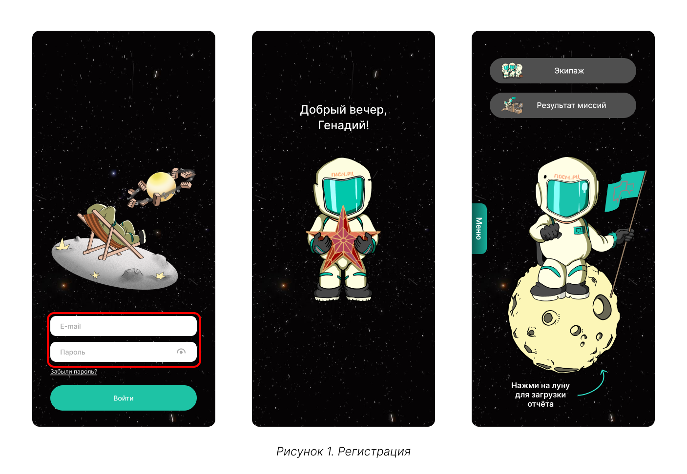
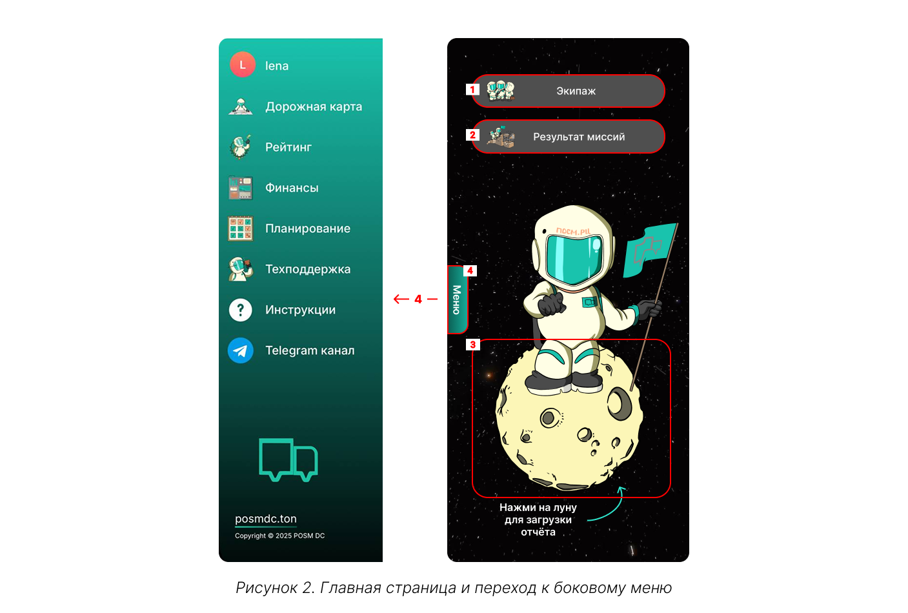
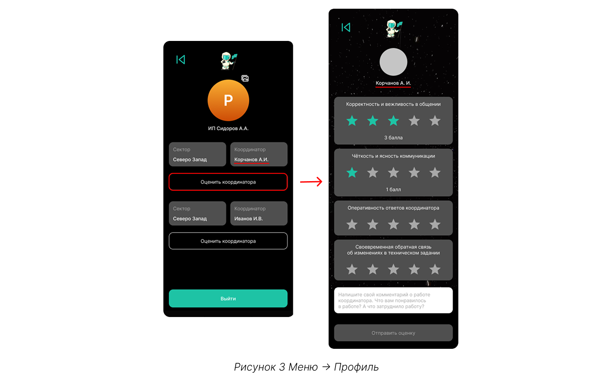
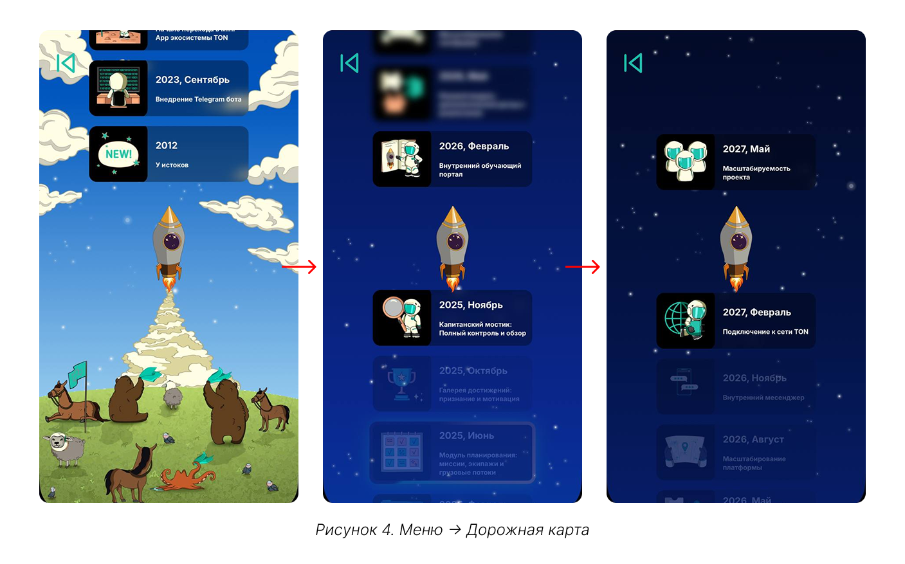
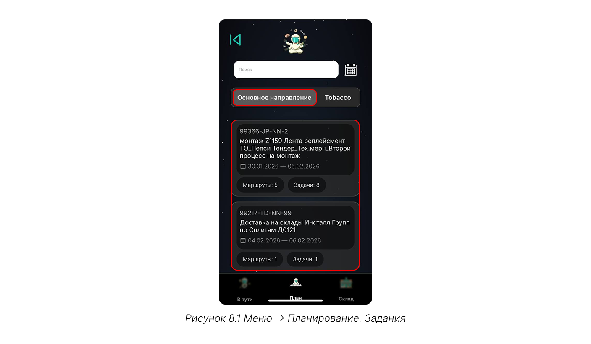
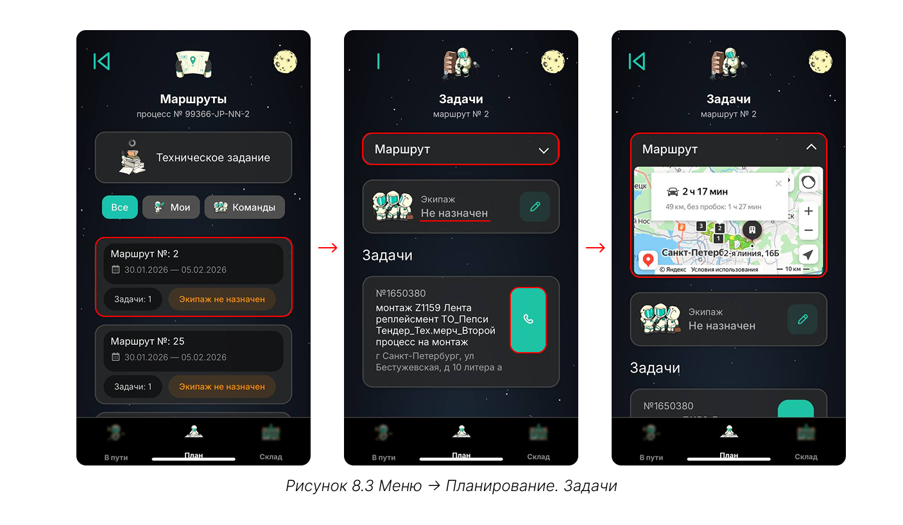
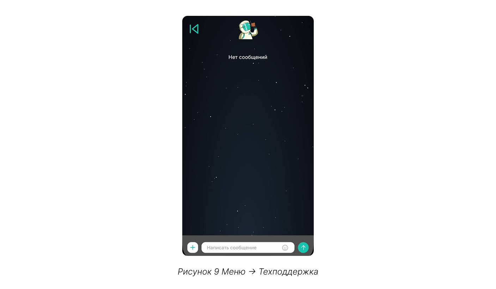
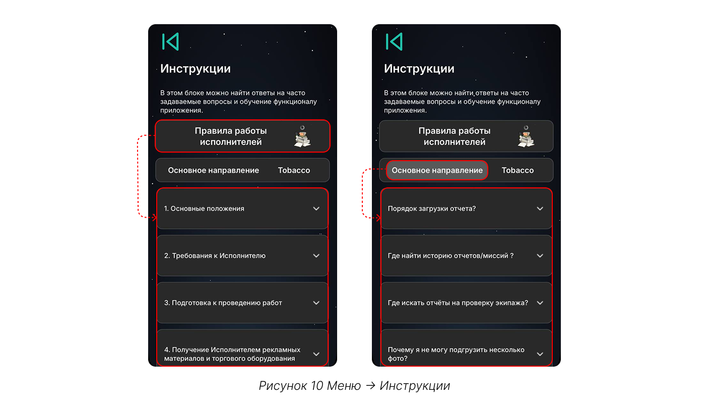

# С чего начать

## Шаг 1. Регистрация

Запустите телеграм-бот [@CT_DC_bot](https://t.me/CT_DC_bot) по команде «Launch_CT_DC» или /start и введите выданные ранее логин (email) и пароль. 

{.center width=1200}



Вы можете передавать свои логин и пароль доверенным лицам. Однако, **доступ к системе также привязан и к профилю телеграм**, из которого выполняется вход. Это означает, что если несколько человек используют одни и те же [учётные данные](*key_data), система будет распозновать их как разных пользователей — по их телеграм-аккаунту.



Среди нескольких пользователей одного аккаунта контрагента для дальнешей работы **выделяется главный и второстепенные пользователи.** Право подтвердить статус главного контрагента предоставляется первому пользователю, выполнившему вход с выданными учётными данными: все последующие пользователи, использующие те же логин и пароль, автоматически получают статус второстепенных. 

Для разных пользователей в личном кабинете доступен индивидуальный чат с технической поддержкой: **запросы и переписка одного пользователя не видны другому.** 

Также **только главный контрагент может выставлять оценки координаторам** за отчётный период — вся остальная функциональность платформы (работа с заказами, отчётами, командой) полностью доступна всем пользователям аккаунта контрагента.

## Шаг 2. Знакомство с интерфейсом

На главной странице доступно четыре команды:

{.center width=1200}

1. **[экипаж](./work_with_team.md "Экипаж")** — добавление членов экипажа и управление командой;
2. **[результат миссий](./mission.md "Миссии")** — просмотр истории выполненных заданий, а также отчёты, которые находятся на проверке или отклонены;
3. **[загрузка отчёта](./report.md "Загрузка отчёта")** — фиксация результатов работы;
4. **[меню](#шаг-3-меню)** — дополнительная функциональность.

## Шаг 3. Меню

### 3.1. Профиль 

14 и 29 числа, на следующий день после завершения отчётного периода, для главного пользователя появляется возможность оценить работу с координатором по нескольким параметрам и оставить развернутую обратную связь.  

{.center width=1200} 

Также на вкладке «Профиль» можно выйти из текущей учётной записи. 

### 3.2. Дорожная карта 

Интерактивная дорожная карта знакомит с историей развития компании и планами по развитию MiniApp. На странице отражены ключевые этапы пути и стратегия на будущее.

{.center width=1200}

### 3.3. Рейтинг

Выполнение любого заказа оценивается по восьми метрикам: чем качественнее выполнена работа, тем больше баллов начисляется по каждому параметру. 



Метрики, в разрезе которых оценивается качество выполнения заказа:
1. **качество сроков** — отражает, насколько своевременно задачи выполняются в соответствии с дедлайнами: чем точнее соблюдены сроки, тем выше ваш результат в сравнении с другими контрагентами;
2. **скорость завершения проектов** — отражает, насколько быстро задачи закрываются с момента их старта в сравнении с другими контрагентами;
3. **внедрение** — оценивает, насколько активно вы используете наш MiniApp для загрузки отчетов в сравнении с другими контрагентами;
4. **эффективность сроков** — показатель качества выполнения задач, учитывающий количество дней опозданий в сравнении с другими контрагентами;
5. **динамика выполнения** — показатель, как быстро вы можете выполнять задачи в сравнении с другими контрагентами;
6. **объем задач** — показатель того, насколько много задач вы выполняете в сравнении с другими контрагентами: чем больше выполнено задач, тем выше ваша оценка;
7. **отклонения отчетов** — показатель, какой процент задач был отклонен по всем выполненным работам в сравнении с другими контрагентами; 
8. **экономическая результативность** — отражает, насколько эффективным и ценным является ваше сотрудничество с нами с точки зрения соотношения затрат и полученных результатов в сравнении с другими контрагентами. 



Баллы суммируются и определяют место в рейтинге в общем по компании и в секторе, к которому относится контрагент. 

{.center width=1200}



**Количество баллов в общем рейтинге и в рейтинге сектора может различаться,** так как баллы рассчитываются отдельно. Начисление происходит динамически, на основе сравнения ваших результатов с показателями других контрагентов в соответствующей группе (компании или секторе). Поэтому итоговые значения по одним и тем же метрикам могут отличаться. 

**Например:** по показателю «отклонение отчётов» в общем рейтинге вам могло быть начислено 3,5 балла, а в рейтинге вашего сектора за тот же параметр — 5 баллов.   



В разделе «Динамика результатов» вы видите изменение своих показателей за месяц, полгода или год. Графики помогают анализировать периоды роста и спада, а для последнего месяца можно сравнить результаты двух отчётных дат (13 и 29 числа месяца).

{.center width=1200}

Чтобы определить цели для роста, ориентируйтесь на показатели других участников. В рейтинге отображаются топ-5 контрагентов с указанием их места и баллов, а также список 5 аутсайдеров с худшими результатами

{.center width=1200}

### 3.4. Финансы

В разделе «Финансы» **активны вкладки «Кошелёк» и «Поручения».** 
Функции «Маркетплейса» и «Чёрного рынка» находятся в разработке.



- Кошелёк

    Здесь отражены заработанные в отчетном периоде деньги и баллы.
    При клике на карточку с деньгами отражается следующая структура:

    {.center width=1200}

    1. **Шкала прогресса** показывает соотношение между фактическим и потенциальным доходом. 
    Фактический заработок («вы заработали») — это сумма, которая будет отражена в поручении за уже выполненные задачи(5). 
    Потенциальный доход («вы можете заработать») — это общая стоимость работ по заказам, назначенным на вас в текущем отчётном периоде. 
    2. **Поисковая строка** пмогает найти задачу по номеру, названию процесса, адресу или имени исполнителя;
    3. **Команда «...»** разворачивает и сворачивает информацию по всем задачам в списке;
    4. **Календарь** позволяет посмотреть задачи, которые были выполнены в выбранном периоде; 
    5. **Список задач** состоит из всех заданий отчётного периода.

    При клике на карточку с баллами отражается детализация начислений за каждый отчётный период — 13 и 28 число каждого месяца. 
    
    {.center width=1200}

    На одну дату приходится по два начисления — отдельно по общему рейтингу компании и по рейтингу сектора. Каждое начисление можно развернуть, чтобы увидеть подробную разбивку: по каким именно параметрам и сколько баллов было начислено.    

- Поручение

    Здесь хранятся поручения, сформированные по ранее завершенным задачам. 

    Каждое **поручение состоит из трёх документов**: само поручение, акт и счет. Когда поручение будет сформировано и появится на вкладке, его необходимо скачать и распечатать, а после — ознакомиться с содержанием и подписать.
    
    Поручения формируются 13 и 28 числа каждого месяца в 17:00. В момент формирования отдел делопроизводства вызывает курьера, а координатор связывается с вами и согласовывает удобное время. После передачи документов курьеру необходимо в системе отметить все переданные поручения и подтвердить их отправку.
    
    {.center width=1200}

    Когда документы поступили, делопроизводство проверяет их. Если всё в порядке, поручение получает статус «Передано на оплату». Обычно оплата поступает в течение 10 дней с момента получения документов. После зачисления средств статус поручения меняется на «Оплачено».

    

    Иногда по некоторым заказам требуется вернуть часть документов. В этом случае формируется два поручения: одно — для задач, не требующих возврата документов, другое — для задач, оплата по которым возможна только после предоставления недостающих документов. 
    Поручения могут получить один из следующих статусов:
    * «Ожидает возврата отчётных документов» — необходимо вернуть дополнительные документы, 
    * «Ожидает возврата закрывающих документов» — отсутствуют акт, счёт или поручение,
    * «Ожидает возврата Чека СЗ» — для самозанятых. 

     



### 3.5. Планирование

На вкладке «Основное направление» собраны **задания, на которые координатор назначил вас исполнителем,** вкладка «Tobacco» не используется. 

{.center width=1200}

Для каждого задания доступно техническое задание (ТЗ), которое едино для всех задач и маршрутов в рамках задания.
 
{.center width=1200}

Задачи группируются по маршрутам. Вы можете просмотреть маршрут на встроенной карте. Есть возможность назначить экипаж, если он еще не назначен — **на 1 маршрут можно назначить только одного исполнителя.** Маршруты в рамках задания можно отфильтровать: «мои» показывают те, на которые не назначен никто из экипажа,а «команды» — задачи с назначенными исполнителями.

Также для каждой задачи указано контактное лицо — ему можно позвонить прямо из MiniApp. 

{.center width=1200}

### 3.6. Техподдержка

При возникновении ошибок в работе платформы обратитесь в техподдержку. 
У каждого пользователя личная история сообщений, которую не видят другие.

{.center width=1200}

### 3.7. Инструкции

Часто возникающие вопросы собраны на вкладке «Инструкции». 

{.center width=1200}

«Правила работы исполнителей» содержат все требования к:
- исполнителю;
- подготовке до начала выполнения работ;
- проведению работ;
- доставке, передаче и хранении оборудования;
- отчётам, предоставляемым после проведения работ.

В «Основном направлении» описаны часто задаваемые вопросы, связанные с функционалом и логикой работы MiniApp, вкладка «Tobacco» не используется. 

### 3.8. Telegram канал

[Telegram-канал ПОСМ.РЦ](https://t.me/+-lx6zwwgbqpiNzcy) с новостями, анонсами и обновлениями.  

## Шаг 4. Работа после

После успешного входа в телеграм-чат будут приходить два типа уведомлений:
1. о назначении вас исполнителем — приходит, когда координатор назначил вас на какой-то процесс. Сообщение приходит со встроенной командой «Получить ТЗ»: вы можете скачать все файлы по заданию. После ознакомления из MiniApp можно [назначить исполнителя](./work_with_team.md) из своей команды, и он также получит уведомление с возможностью скачать задание. Все технические задания автоматически закрепляются в чате;
2. об отклонении отчёта — такое уведомление получит и исполнитель, [загрузивший отклоненный отчёт](./report.md), и вы как контрагент, ответственный за исполнителя.

[*key_data]: Учётные данные — логин (электронная почта или email) и пароль.