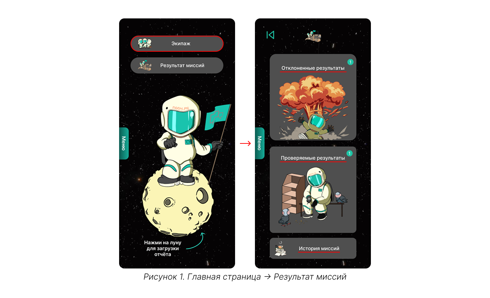
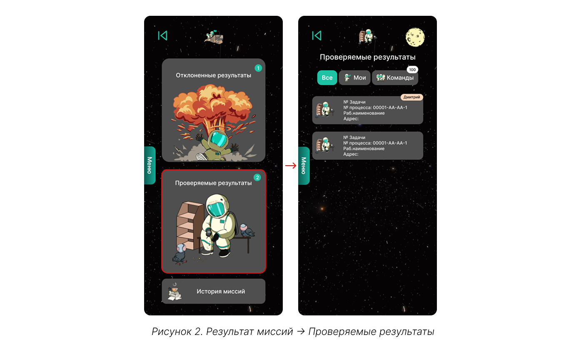
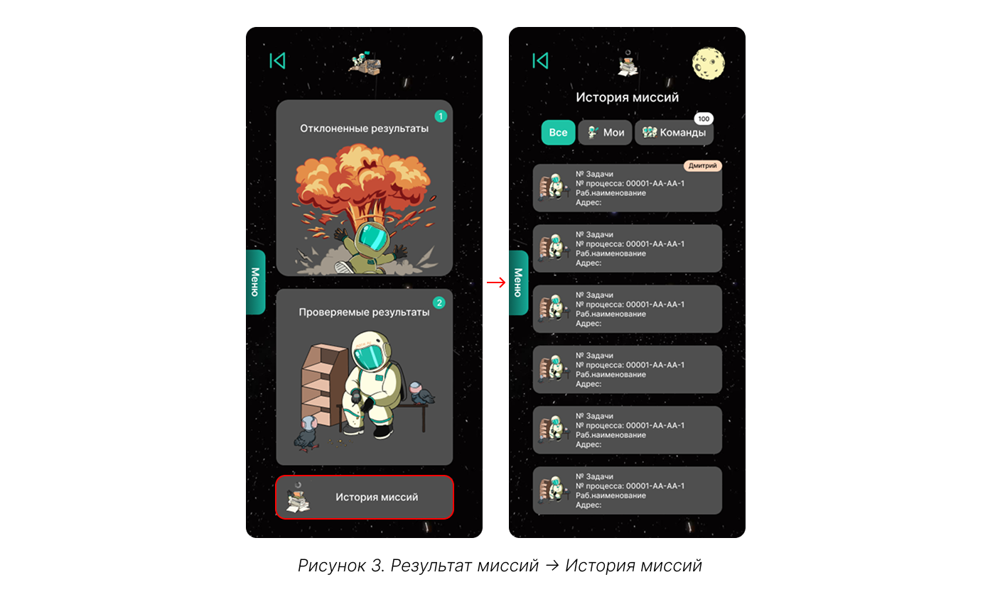
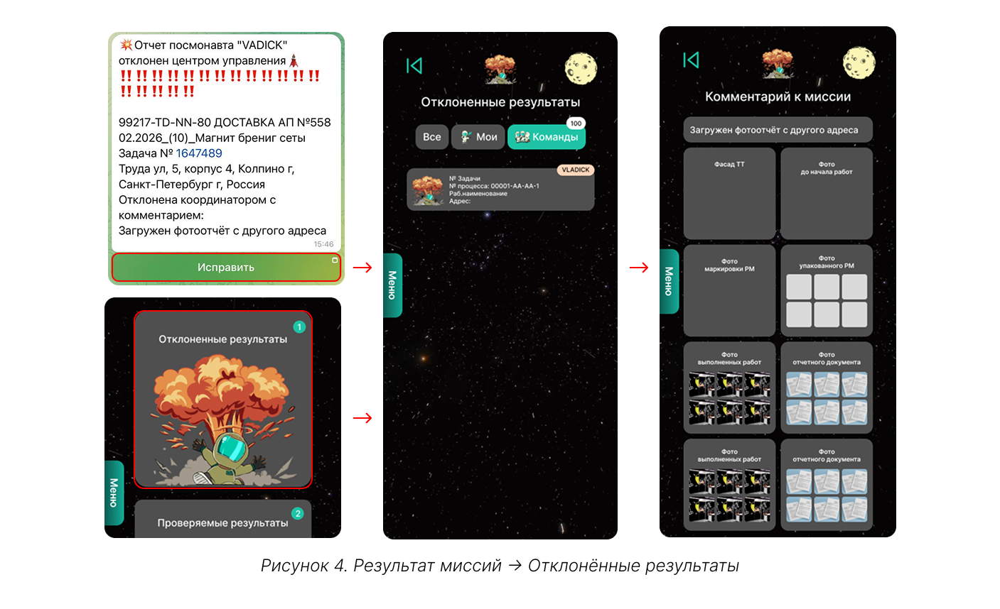
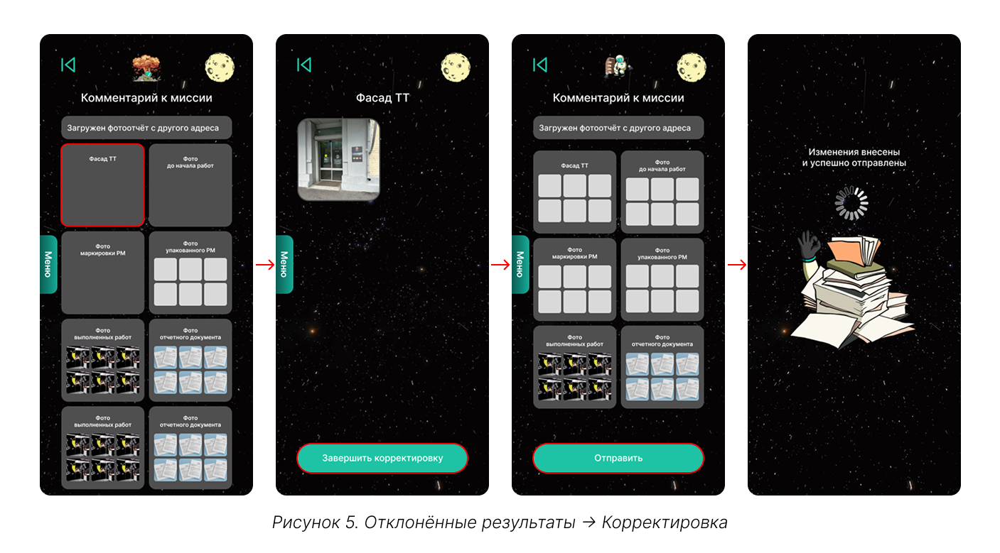

# Результат миссий 

Результат миссий содержит результаты проверок отчётов исполнителей координаторами.

{.center width=1200}

Если отчёт еще находится на проверке у координатора, он будет находиться на вкладке **«Проверяемые результаты».** 

{.center width=1200}



Вы как контрагент будете видеть отчёты всех исполнителей, сами же исполнители будут видеть только свои отчёты.



Если отчёт принят, то он будет перемещен в **«Историю миссий»**: там хранятся все принятые отчёты. А на вкладке [«Финансы» → «Кошелёк»](how_to_start.md#34-финансы) будет на одну выполненную задачу больше. 

{.center width=1200}

Если отчёт отклонён, уведомление об этом приходит в Telegram-чат как исполнителю, так и контрагенту. В сообщении будет кнопка «Исправить», которая открывает конкретную отклонённую заявку. 

{.center width=1200}

И в чате, и в MiniApp будет виден комментарий координатора с указанием причины отклонения. Необходимо исправить отчёт в соответствии с замечаниями и повторно отправить его на проверку.

{.center width=1200}



Если отчёт не будет одобрен, то оплата по нему не будет произведена. 



