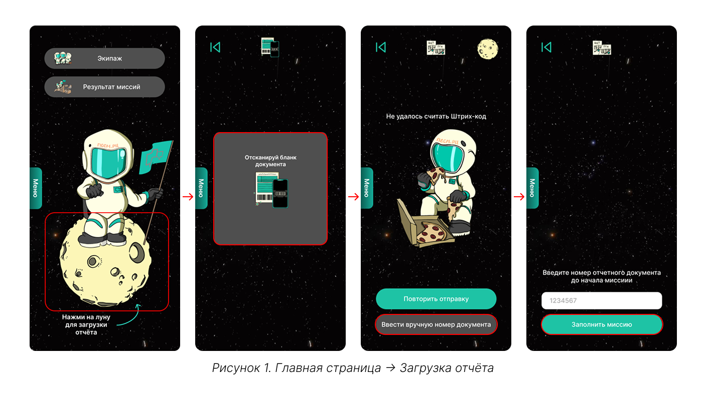
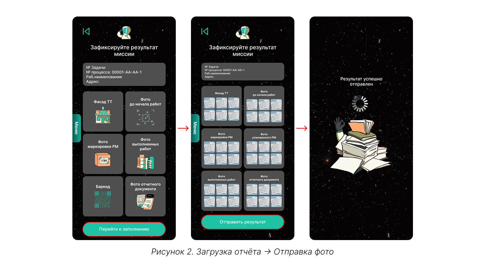

# Загрузка отчёта

После выполнения любой задачи требуется загрузить отчёт. 

{.center width=1200}

Отчёт загружается в систему по штрих-коду на бланке отчётного документа. Если штрих-код не распознан, можно ввести номер документа вручную.

**Система может запретить загрузку, если не обнаружена следующая зависимость**: задача, к которой относится сканируемый документ, должна входить в процесс, по которому контрагент (к экипажу которого принадлежит исполнитель) был назначен ответственным исполнителем.



Если вы используете устройство с операционной системой Android, для работы необходимо перейти в web-версию системы. Функционал web-версии полностью аналогичен возможностям MiniApp в телеграме.



В зависимости от задачи для отчёта требуются фотографии разных категорий. Каждый тип отчётных снимков выделен в отдельную группу, например: «Фото до начала работ» или «Фото маркировки РМ». Загружайте фотографии строго в соответствии с указанной категорией.

{.center width=1200}

При возникновении ошибок обращайтесь в техподдержку. 